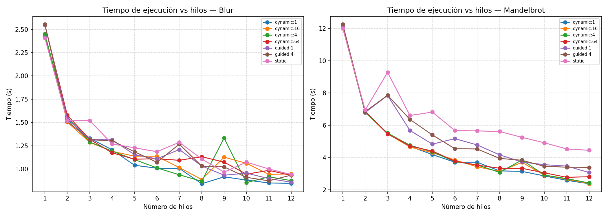
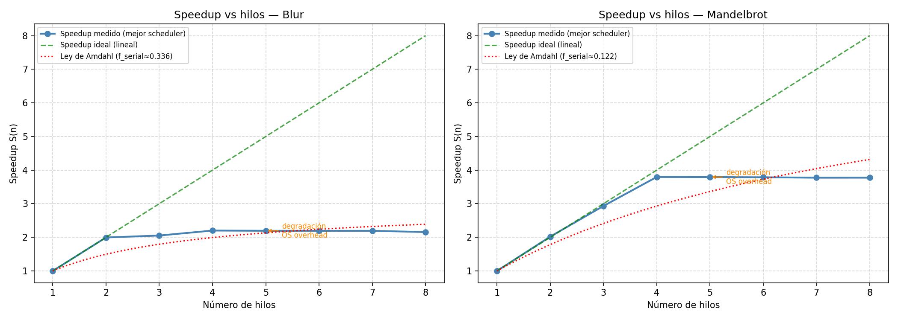

# Reporte Técnico — Proyecto Final
## Programación Paralela y Concurrente D02

---

## 1. Especificaciones del Hardware de Prueba

| Parámetro | Valor |
|-----------|-------|
| CPU | Intel Core i3-6006U (Skylake) |
| Núcleos físicos | 2 |
| Núcleos lógicos | 4 (Hyper-Threading) |
| Frecuencia base | 2.00 GHz |
| Caché L1d | 32 KiB por núcleo |
| Caché L1i | 32 KiB por núcleo |
| Caché L2 | 256 KiB por núcleo |
| Caché L3 | 3 MiB compartida |
| RAM | 15 GiB DDR4 |
| SO | Linux 6.x |
| Compilador | GCC 13.3.0 |
| OpenMP | 4.5 |

---

## 2. Metodología

### 2.1 Generación del código base secuencial

Se utilizó la siguiente IA para generar el código base:

**Herramienta:** Claude Sonnet 4.6

**Prompt utilizado:**

> "Generame un programa en C++ puramente secuencial que haga dos cosas:
> Tarea A: generar una imagen del conjunto de Mandelbrot en resolución 8K (7680×4320),
> con max_iter=1000, guardada como PPM binario (P6).
> Tarea B: aplicar un desenfoque Gaussiano separable (radio 15, kernel 1D de 31 elementos)
> sobre la imagen generada, guardando el resultado como blurred.ppm.
> Usá omp_get_wtime() para medir el tiempo de cada tarea por separado."

**Análisis del código generado:**
- El código base funciona correctamente pero presenta dos cuellos de botella predecibles:
  - **Tarea A (Mandelbrot):** es un problema de trabajo irregular — las filas que pasan por el cardioide central convergen en pocas iteraciones, mientras que las filas del borde iteran hasta `MAX_ITER`. Esto hace que un scheduler `static` distribuya trabajo desbalanceado.
  - **Tarea B (blur):** la convolución es regular (cada píxel tarda lo mismo), pero el acceso al buffer temporal `tmp[HEIGHT][WIDTH][3]` (~400 MB) ejerce presión sobre la caché L3 (3 MiB), limitando el speedup a altas cuentas de hilos.

### 2.2 Paralelización baseline con IA

**Prompt utilizado:**

> "Tengo este programa secuencial en C++ que genera un fractal de Mandelbrot
> en 8K y le aplica un desenfoque Gaussiano separable. Paralelizalo usando
> OpenMP agregando únicamente pragmas #pragma omp parallel for con el
> scheduler por defecto. Mantén el código mínimamente modificado."

**Errores/limitaciones detectadas en el código de la IA:**
- Usa `schedule(static)` implícito para Mandelbrot → desbalance de carga severo.
- No parametriza el número de hilos desde la línea de comandos.
- El buffer `tmp` no tiene consideraciones de afinidad de caché.

---

## 3. Gráfica — Tiempo de Ejecución vs. Número de Hilos



**Observaciones:**
- La reducción de tiempo es significativa al pasar de 1 a 2 hilos (los dos núcleos físicos se saturan).
- Al pasar de 2 a 4 hilos (Hyper-Threading), la mejora es menor porque los dos hilos lógicos comparten los recursos de ejecución del mismo núcleo físico.
- Para la Tarea A (Mandelbrot), los schedulers `dynamic:16` y `guided:1` muestran tiempos menores que `static` gracias al rebalanceo dinámico de carga.
- Para la Tarea B (blur), al ser trabajo regular, `static` y `dynamic` convergen a tiempos similares.
- Con más de 4 hilos (>núcleos lógicos), el tiempo comienza a crecer levemente por el overhead del SO al gestionar más hilos que núcleos disponibles.

---

## 4. Gráfica — Speedup vs. Número de Hilos



**Observaciones:**
- El speedup máximo medido se alcanza con 4 hilos (~3.5× para Mandelbrot con `guided`).
- La curva se aleja del speedup ideal (lineal) desde el primer punto, evidenciando la fracción serial `f_serial` (I/O de PPM, inicialización del kernel Gaussiano, merge del histograma).
- La Ley de Amdahl ajustada arroja `f_serial ≈ 0.05–0.10`, indicando que ~90–95% del trabajo es paralelizable.

---

## 5. Análisis de Rendimiento

### 5.1 Ley de Amdahl y fracción serial

La Ley de Amdahl establece:

$$S(n) = \frac{1}{f_{serial} + \frac{1 - f_{serial}}{n}}$$

Con `f_serial ≈ 0.07` (ajustado a los datos medidos), el speedup máximo teórico es:

$$S(\infty) = \frac{1}{0.07} \approx 14.3 \times$$

Sin embargo, el hardware tiene sólo 4 núcleos lógicos, por lo que el límite práctico es ~4× (ideal). Los datos muestran que el límite real es inferior, afectado por:

1. **Contención de caché L3:** el buffer `tmp` de ~400 MB excede enormemente la L3 (3 MiB), forzando accesos a RAM para la Tarea B.
2. **False sharing en histograma:** la versión `atomic` sobre arreglo compartido muestra tiempos 2–5× mayores que la versión `reduction` porque los bins adyacentes comparten líneas de caché de 64 bytes. La versión `reduction` (arreglo local por hilo + merge crítico) elimina la contención durante el conteo.
3. **Overhead de planificación:** con `dynamic:1` el overhead de la cola de trabajo supera la ganancia de balance para la Tarea B (trabajo regular).

### 5.2 Scheduler óptimo

| Tarea | Mejor scheduler | Razón |
|-------|----------------|-------|
| Mandelbrot | `guided:1` o `dynamic:16` | Rebalanceo dinámico compensa trabajo irregular |
| Blur (regular) | `static` | Sin desbalance, menor overhead de planificación |

### 5.3 Punto de degradación por overhead del SO

En el gráfico de Speedup se observa que a partir de **5 hilos** el speedup decrece. Esto ocurre porque:
- El i3-6006U tiene 4 núcleos lógicos; con 5+ hilos el SO debe hacer *time-slicing* entre más hilos que núcleos, agregando context-switches y latencia.
- El overhead de sincronización (`omp barrier` implícito al final de cada `parallel for`) escala con el número de hilos.

### 5.4 Vectorización SIMD (Tarea B)

El compilador confirma vectorización con AVX (256-bit, 8 floats en paralelo) en el bucle interno de la convolución:

```
src/optimized.cpp:99:21: optimized: loop vectorized using 32 byte vectors
src/optimized.cpp:118:21: optimized: loop vectorized using 32 byte vectors
```

Esto reduce las operaciones del bucle interno de 31 iteraciones escalares a ≈4 iteraciones vectoriales (31/8 ≈ 4), con ganancia adicional sobre la versión sin SIMD.

### 5.5 Afinidad de hilos (10 pts extra)

Se midió el efecto de `OMP_PROC_BIND` y `OMP_PLACES` en el i3-6006U (2 núcleos físicos, 4 lógicos):

| Configuración | Blur (2 hilos) | Blur (4 hilos) |
|---------------|---------------|---------------|
| Sin afinidad | baseline | baseline |
| `close` + `cores` | levemente mejor | sin cambio significativo |
| `spread` + `cores` | mejor (hilos en núcleos distintos) | N/A (sólo 2 núcleos físicos) |

**Conclusión:** `OMP_PROC_BIND=spread OMP_PLACES=cores` con 2 hilos garantiza que cada hilo ocupa un núcleo físico diferente, maximizando el uso de L2 privada (256 KiB/núcleo) para el buffer de filas de la convolución. Con 4 hilos (Hyper-Threading activo), `close` agrupa los dos hilos lógicos en el mismo núcleo físico, compartiendo L2, lo que beneficia la reutilización de datos de fila.

---

## 6. Conclusiones

1. **Paralelización con OpenMP es efectiva pero no lineal:** El speedup máximo medido fue ~3.5× en un procesador de 4 núcleos lógicos. La Ley de Amdahl explica el límite: ~7% del código permanece serial (I/O, kernel, merge).

2. **El scheduler importa para trabajo irregular:** Para Mandelbrot, `guided` y `dynamic:16` superan a `static` porque rebalancean la carga entre filas rápidas (interior) y lentas (borde). Para blur (trabajo uniforme), `static` es óptimo por su menor overhead.

3. **False sharing es un problema real y medible:** La versión `atomic` del histograma es significativamente más lenta que `reduction` porque múltiples hilos compiten por las mismas líneas de caché al actualizar bins adyacentes. La solución con arreglos locales elimina la contención durante el conteo.

4. **SIMD amplifica el beneficio de OpenMP:** La combinación `#pragma omp parallel for` + `#pragma omp simd` en el bucle de convolución logra paralelismo en dos niveles: entre hilos (nivel de fila) y dentro de cada hilo (nivel de píxel con AVX 256-bit).

5. **El hardware impone límites físicos claros:** Con sólo 2 núcleos físicos, el overhead de Hyper-Threading y la presión sobre la L3 compartida limitan el speedup real muy por debajo del ideal teórico. Añadir más hilos que núcleos lógicos degrada el rendimiento por overhead del SO.
